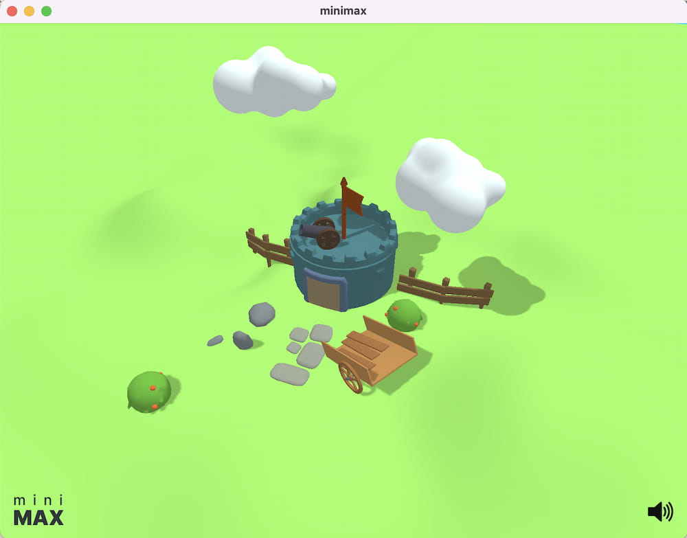

Minimalist 3D game engine in Clojure

> In game theory, minimax is a decision rule used to minimize the worst-case potential loss; in other words, a player considers all of the best opponent responses to his strategies, and selects the strategy such that the opponent's best strategy gives a payoff as large as possible.
>
> — <cite>https://brilliant.org/wiki/minimax/</cite>

## How to run

_Tested on Mac (Metal) / Windows (DX11) / Linux (Vulkan). Note that **not supporting OpenGL** currently for shader function compatibility._

- Make sure to replace [native packages in deps](https://github.com/roman01la/minimax/blob/main/deps.edn#L15-L23) with the ones matching your platform
- Compile shaders `./scripts/shaders` (or `nu ./scripts/shaders.nu`) (shaders code might need changes depending on rendering backend choosen on your platform)
- Run the sample project `./scripts/start` (or `nu ./scripts/start.nu`)

## Features

- Windowing and input handling
- GLTF loader
- Renderer
  - Blinn–Phong shading
  - Shadow maps
- Scene graph
- Audio playback
- Small and incomplete UI system
  - Scroll views
  - Buttons
  - Component system with local state
  - Flexbox layout
